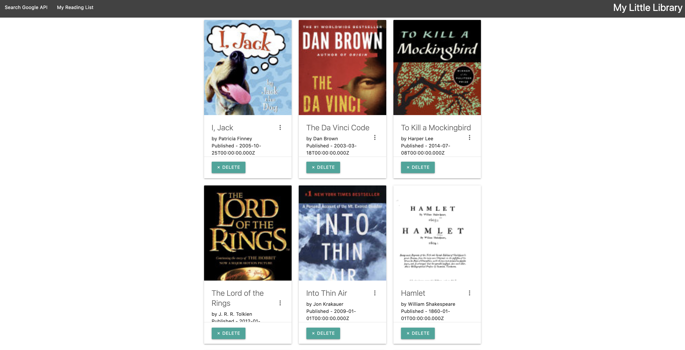

# google-books
### MERN book search app 📚

### Overview

This app searches for books by hitting the Google Books API and allows the user to save the wanted books to a MongoDB and create a reading list.  The user can also delete a book from the reading list.
* Heroku link https://danasbooks.herokuapp.com/books
* Portfolio link https://danalittleskier.github.io/Portfolio/

### Technologies

* MongoDB
* Express
* React
* Node.js

### Screenshot

### Role

Dana Alexandrescu - developer